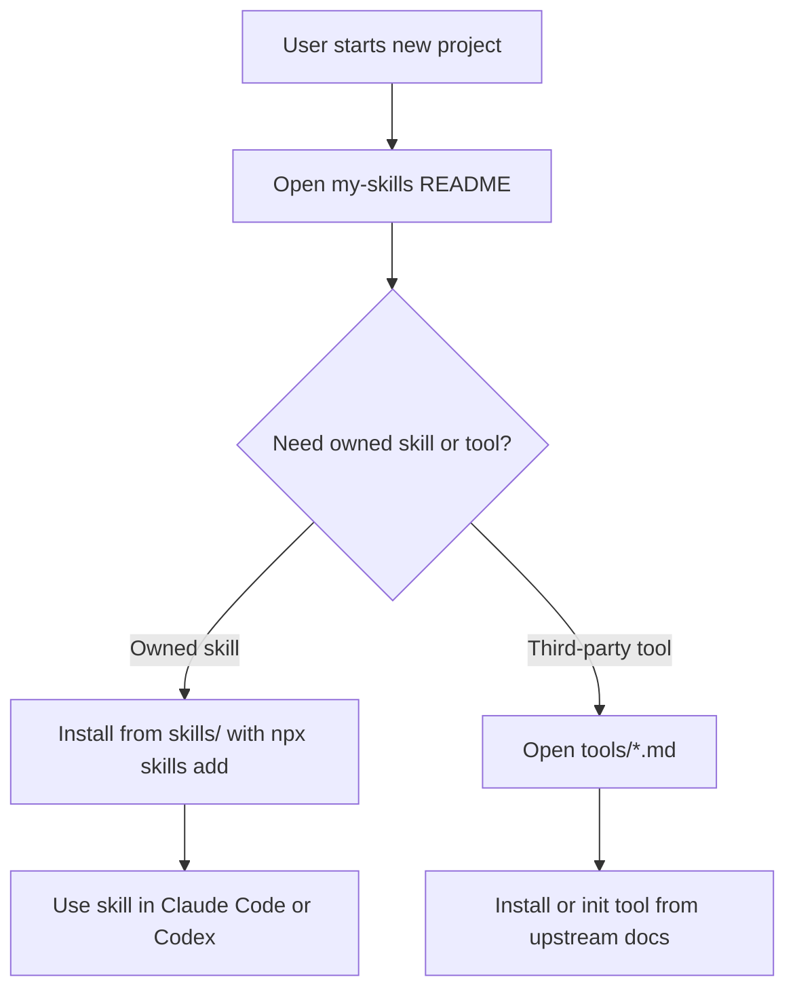
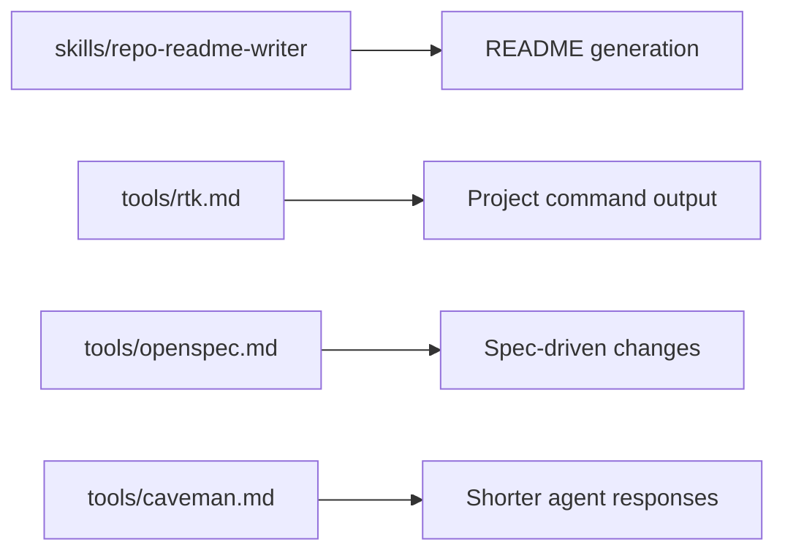

# My Skills

Personal agent setup repo for Claude Code, Codex, and related coding tools.

This repo has two kinds of things:

- **Owned skills**: skills I create or customize. These live in `skills/`.
- **Tools I use**: third-party tools with their own installers or project init commands. These live in `tools/`.

The point is simple: keep one place that explains what I use, how to install it, and when it belongs in a project.

## Repo Layout

```text
.
├── skills/
│   └── <skill-name>/
│       ├── SKILL.md
│       ├── references/
│       ├── scripts/
│       └── assets/
├── tools/
│   ├── caveman.md
│   ├── openspec.md
│   └── rtk.md
└── templates/
    └── skill/
        ├── SKILL.md
        ├── references/
        ├── scripts/
        └── assets/
```

## Owned Skills

- One skill per `skills/<skill-name>/` directory.
- Skill directory names use kebab-case, for example `api-review`.
- Every skill has a `SKILL.md`.
- Default skills use portable frontmatter with `name` and `description`.
- Optional supporting files live inside the skill directory.

Current owned skills:

- `repo-readme-writer`: creates or improves a repo-aware `README.md` with product story, flow diagrams, architecture diagrams, stack, setup, and Web3 contract details when relevant.

Install owned skills from this repo with `npx skills add`:

```bash
npx skills add lapsapthong-16/my-skills \
  --skill repo-readme-writer \
  --agent claude-code \
  --agent codex \
  --global
```

Restart Claude Code or Codex after installing new skills.

## Add An Owned Skill

1. Pick a kebab-case skill name:

   ```bash
   export SKILL_NAME=my-new-skill
   ```

2. Copy the template:

   ```bash
   mkdir -p "skills/$SKILL_NAME"
   cp -R templates/skill/. "skills/$SKILL_NAME/"
   ```

3. Edit `skills/<skill-name>/SKILL.md`:

   ```md
   ---
   name: my-new-skill
   description: Use when ...
   ---

   # My New Skill

   ## When To Use

   Use this skill when ...
   ```

4. Add only the resources the skill needs:

   - `references/` for detailed docs that should be read only when relevant.
   - `scripts/` for repeatable helper scripts.
   - `assets/` for templates, images, fixtures, or other files used in outputs.

5. Commit and push the skill:

   ```bash
   git add skills/<skill-name>
   git commit -m "Add <skill-name> skill"
   git push
   ```

## Tools I Use

Tools are third-party projects that are not owned by this repo. Each tool page explains what it is, how to install it, and how to initialize it inside a project when that applies.

- [Caveman](./tools/caveman.md): token-saving skill/plugin pack.
- [OpenSpec](./tools/openspec.md): spec-driven change workflow.
- [RTK](./tools/rtk.md): token-saving command proxy.

## Import Skills For A Project

Prefer global installation and document project expectations in the project README:

````md
This project uses skills from lapsapthong-16/my-skills:

- repo-readme-writer

Install them globally:

```bash
npx skills add lapsapthong-16/my-skills -s repo-readme-writer -a claude-code -a codex -g
```
````

If a project needs local skill folders, keep Git behavior explicit.

For local-only excludes that do not affect teammates:

```bash
printf ".claude/skills/\n.codex/skills/\n" >> .git/info/exclude
```

For a team-wide rule, add this to the project `.gitignore`:

```gitignore
.claude/skills/
.codex/skills/
```

Only commit `.claude/skills/` or `.codex/skills/` when the project intentionally vendors the skill source and the team agrees to maintain those copies.

## Cross-Agent Compatibility

Portable skills should start with only:

```md
---
name: skill-name
description: Use when ...
---
```

Keep the description trigger-oriented. It should describe when the agent should load the skill, not just what the skill is called.

Avoid agent-specific metadata in default skills. If a skill intentionally depends on Claude Code-only or Codex-only behavior, say so in the description:

```md
---
name: claude-release-helper
description: Use in Claude Code only when preparing release notes with Claude-specific command behavior.
---
```

## Skill Quality Checklist

Before committing a skill:

- The directory name is kebab-case.
- `SKILL.md` has `name` and `description` frontmatter.
- The description clearly says when to use the skill.
- The body is concise and procedural.
- Large reference material lives in `references/`, not directly in `SKILL.md`.
- Scripts are included only when they make repeated work safer or more deterministic.
- Agent-specific behavior is clearly labeled.

## Diagram Preview

This section is only here to compare Mermaid-in-Markdown with Mermaid CLI exported assets.

### Mermaid In README

GitHub renders this directly from the Markdown code block. No generated image file is needed.



### Mermaid CLI Exported Asset

With Mermaid CLI, the diagram source lives in a `.mmd` file and the rendered output is exported to an image file such as SVG or PNG.

Example source file:

```text
docs/diagrams/agent-stack.mmd
```



Example export command:

```bash
npx -p @mermaid-js/mermaid-cli mmdc \
  -i docs/diagrams/agent-stack.mmd \
  -o docs/images/agent-stack.svg
```

Then the README references the generated file:

```md

```
