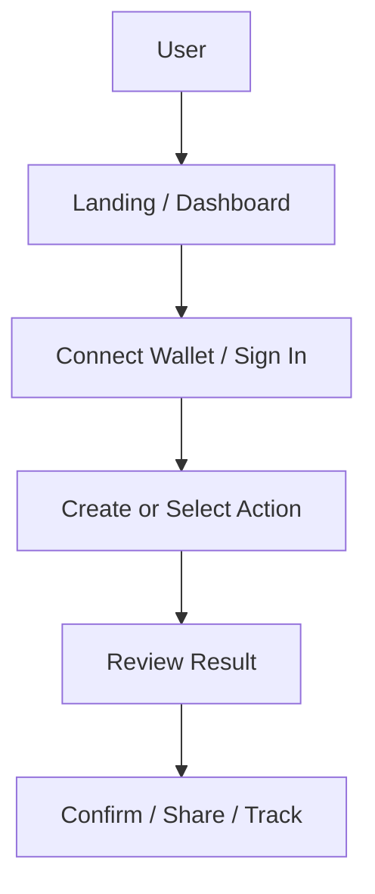
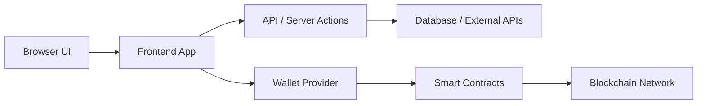

# README Section Reference

Use this only when the README needs detailed section guidance, diagrams, or tables.

## Section Guidance

### Story Scenario

Write a short scenario with a concrete user, context, and pain point. Avoid vague marketing copy.

### Problem Statement

State what is broken, inefficient, risky, confusing, or missing.

### Solution

Tie the solution to actual implemented features, not imagined future features.

### Product Concept

Describe:

- Core experience
- Key features
- Primary user
- What makes the approach distinct

### User Flow

Include a user flow diagram when the repo has a meaningful product journey. Prefer Mermaid directly in the README. Use ASCII only as a fallback.



### System Architecture Flow

Include an architecture diagram for multi-part apps. Base it on the actual repo.



### Diagram Update Rules

For a new README, create Mermaid diagrams only when they clarify the product. Keep node labels short.

For an existing README, update existing Mermaid diagrams instead of adding duplicates. Replace ASCII with Mermaid only when the flow is clear. Preserve accurate image or external diagram links.

### Tech Stack

Use grouped lists or a table. Include only technologies actually present or clearly required.

Suggested groups:

- Frontend
- Backend
- Database / Storage
- Blockchain / Web3
- AI / APIs
- Tooling
- Deployment

### Smart Contracts

For Web3 projects, include a table:

```md
| Contract | Network | Address | Purpose |
| --- | --- | --- | --- |
| ExampleContract | TBD | TBD | Handles ... |
```

Find addresses in deployment files, config files, `.env.example`, frontend constants, docs, or scripts. Do not hallucinate addresses.

### Getting Started / Running Locally

Use commands from the repo. Prefer exact package scripts over generic commands.

```bash
npm install
npm run dev
```

Do not claim a command works unless it is present or strongly implied by the repo.

### Environment Variables

Read `.env.example` if present. Use a table:

```md
| Variable | Purpose |
| --- | --- |
| NEXT_PUBLIC_CONTRACT_ADDRESS | Frontend contract address |
```

If no env example exists, include a short note and only list variables discovered in code.

### Demo / Screenshots

If assets exist, reference them. If not, use a placeholder sentence:

```md
Add screenshots or a demo link here after deployment.
```

## Style Notes

- Be concrete and repo-specific.
- Prefer short paragraphs and tables.
- Use emojis sparingly only when they improve scanning.
- Avoid repeated emoji patterns, decorative clutter, and emojis in commands, code blocks, addresses, environment variable names, or legal/security notes.
- Avoid hype that the code does not support.
- Avoid long architecture essays.
